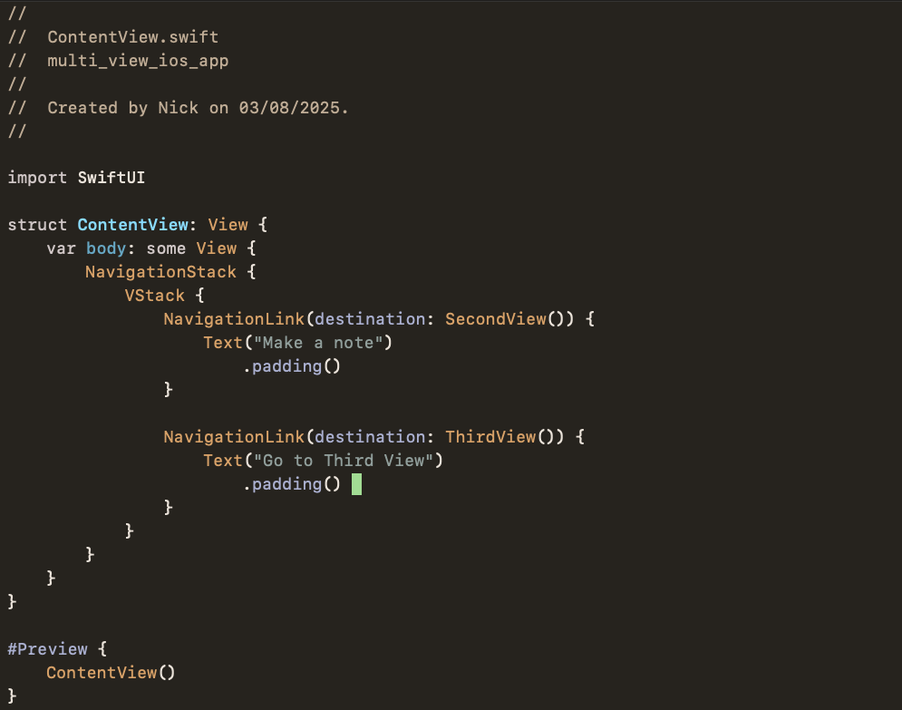

# Melangey

A dark, warm Xcode color theme inspired by [melange-nvim](https://github.com/savq/melange-nvim) by [@savq](https://github.com/savq).



## About

Melangey brings the cozy, warm aesthetic of the melange Neovim theme to Xcode with some thoughtful modifications:

- **Darker background** for reduced eye strain during long coding sessions
- **Pale green cursor** for better visibility and a touch of nature
- **Dark blue selection highlight** for clear text selection
- **Vim-friendly highlighting** that respects your workflow - no current line highlighting unless in insert mode

## Features

- Warm, earthy color palette that's easy on the eyes
- High contrast syntax highlighting for better code readability
- Consistent theming across all Xcode interface elements (editor, console, debugger)
- Optimized for both light and dark room environments
- Carefully chosen colors that maintain accessibility standards

## Installation

### Method 1: Download and Install

1. Download the `Melangey.xccolortheme` file from this repository
2. Double-click the file to install it automatically in Xcode
3. Restart Xcode if it's currently running

### Method 2: Manual Installation

1. Clone or download this repository
2. Copy `Melangey.xccolortheme` to your Xcode themes directory:
   ```bash
   cp Melangey.xccolortheme ~/Library/Developer/Xcode/UserData/FontAndColorThemes/
   ```
3. Restart Xcode

## Activation

1. Open Xcode
2. Go to **Xcode** → **Settings** (or **Preferences** in older versions)
3. Navigate to the **Themes** tab
4. Select **Melangey** from the list of available themes
5. Enjoy your new warm, cozy coding environment!

## Customization

The theme uses SFMono font family at 11pt size. You can modify the font settings in Xcode's preferences while keeping the color scheme intact.

## Credits

This theme is inspired by and pays homage to:
- [melange-nvim](https://github.com/savq/melange-nvim) by [@savq](https://github.com/savq) - The original melange theme that inspired this adaptation
- The warm, earthy color palette that makes coding feel like a cozy evening by the fireplace

---

*Happy coding! 🔥*
